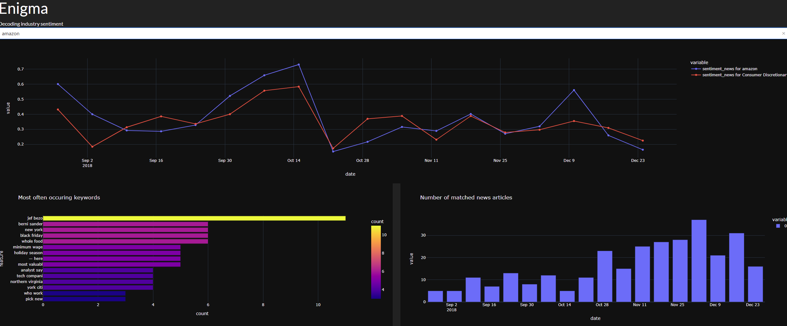

# enigma
web application for text mining / sentiment analysis

Small webapplication that provides insight into industry and company sentiment.

Data has been gathered from twitter and various online news sources.

Sentiment scores (0-1) have been calculated based on a stochasticd gradient classifier (logistic modell)
which in turn used a TF-IDF Vectorizer as feature extractor.

